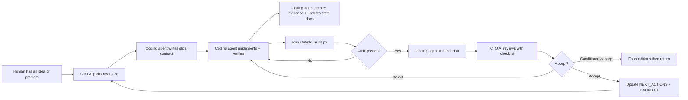

# StateDD Workflow for Beginners

This guide explains the State Driven Development (StateDD) workflow in plain
language, with a diagram, and shows exactly where to get each prompt and where
to paste it.

## The human is always in the loop

StateDD is not "let an AI agent run loose." It is a human-in-the-loop system
with three roles:

1. **Human / product owner** — decides what matters, approves tradeoffs, and
can override workflow steps when necessary. The workflow is a strong default,
not a prison.
2. **CTO AI / product-architecture lead** — chooses the next slice, reviews
handoffs, resolves contradictions, and writes the next coding-agent prompt.
3. **Coding agent** — implements one coherent slice, verifies it with evidence,
and returns a final handoff to the CTO lane.

The human can override any workflow step, but the agent must record the
override honestly. An override does not turn partial work into closure-grade
work.

## Simple workflow diagram



## Where to start — prompts and where to paste them

### I am the human with a new idea

1. Open `prompts/BOOTSTRAP_INTAKE_PROMPT.md`.
2. Paste it into a CTO AI chat (ChatGPT, Claude, Gemini, etc.).
3. Fill in your project name, goals, constraints, and known truth.
4. The CTO AI will draft the initial state files and backlog.

### I am the CTO AI starting a review session

1. Open `prompts/CTO_SESSION_PROMPT.md`.
2. Paste it into a new chat.
3. Paste the current `STATUS.md`, `PROJECT_STATE.yaml`, `NEXT_ACTIONS.md`, and
   `BACKLOG.md` into the chat as context.
4. Review the latest coding-agent handoff using
   `prompts/CTO_REVIEW_CHECKLIST.md`.

### I am the coding agent about to implement a slice

1. Read `AGENTS.md` first.
2. Read `STATUS.md`, `PROJECT_STATE.yaml`, `PROJECT_DNA.yaml`, `NEXT_ACTIONS.md`,
   and `BACKLOG.md`.
3. Run `python3 scripts/statedd_doctor.py` to see the current health snapshot.
4. Write a slice contract using `prompts/SLICE_CONTRACT_TEMPLATE.md`.
5. Implement the slice.
6. Verify with tests, build, lint, and browser/runtime proof when user-facing.
7. Create or update the evidence folder README using
   `prompts/EVIDENCE_README_TEMPLATE.md`.
8. Update only the state files where truth changed.
9. Run `python3 scripts/statedd_audit.py`.
10. Use `prompts/FINAL_HANDOFF_TEMPLATE.md` to write the handoff back to the CTO
    lane.

### I am checking runtime identity before accepting UI changes

1. Use `prompts/RUNTIME_IDENTITY_CHECKLIST.md` before saying a UI change works.
2. Attach screenshot or Playwright/browser evidence to the evidence folder.

### I am freezing a user-facing milestone

1. Use `prompts/ACCEPTANCE_FREEZE_TEMPLATE.md`.
2. Record the milestone in `docs/ACCEPTANCE_FREEZES.md`.

### I need to choose tools or models

1. Use `prompts/TOOL_MODEL_ROUTING_GUIDE.md` when the CTO lane must decide which
   AI model, tool, or settings to use for a slice.

## How to keep the workflow going

1. **Never let the active queue grow.** `NEXT_ACTIONS.md` should stay short.
2. **Close one slice before starting the next.** A slice is not done until it is
   closure-grade or honestly marked as partial.
3. **Always hand off to the CTO lane.** The coding agent should not choose the
   next slice.
4. **Update state files only where truth changed.** Do not rewrite history or
   speculate.
5. **Keep evidence next to claims.** Every claim in the evidence README must
   point to proof.
6. **Run the gates before handoff.**

   ```bash
   python3 scripts/check_state_docs.py
   python3 scripts/statedd_audit.py
   python3 scripts/statedd_doctor.py
   ```

7. **Review with the checklist.** The CTO AI must explicitly answer the
   `prompts/CTO_REVIEW_CHECKLIST.md` questions.
8. **Accept human overrides, but record them.** If the human says "skip this
   step," the agent records it as `Human override used: yes` and states the
   remaining risk.

## How to maintain quality

- **Implemented ≠ validated ≠ closure-grade ≠ accepted.** Code exists is not
the same as reviewed and accepted.
- **No schema may exist only in prose.** Use
  `prompts/SCHEMA_OWNERSHIP_TEMPLATE.md` for every external data shape.
- **Subagent reviews must be strict.** Use
  `prompts/SUBAGENT_REVIEW_TEMPLATE.md` so subagents return verdict, findings,
  required fixes, evidence checked, and confidence only.
- **Major decisions live in ADRs.** Use `docs/adr/` for canonical schema owner,
  import behavior, persistence model, evidence rules, and no-workaround policy.
- **Negative searches stay negative.** Say `not found`, `not currently
  locatable`, or `not proven` instead of guessing.
- **Runtime identity before UI acceptance.** Always prove which build, process,
  port, and URL produced the screenshot.
- **Audit before closure.** `statedd_audit.py` should pass before a slice is
  called closure-grade.

## Quick command reference

```bash
# Health snapshot
python3 scripts/statedd_doctor.py

# Closure audit
python3 scripts/statedd_audit.py

# Documentation hygiene
python3 scripts/check_state_docs.py

# Before leaving bootstrap
python3 scripts/check_state_docs.py --bootstrap-gate

# Initialize a new repo from this template
python3 scripts/init_template.py new --name "My Project" --target ./my-project

# Adopt the workflow into an existing repo
python3 scripts/init_template.py adopt --name "My Project" --target ./existing-repo
```
